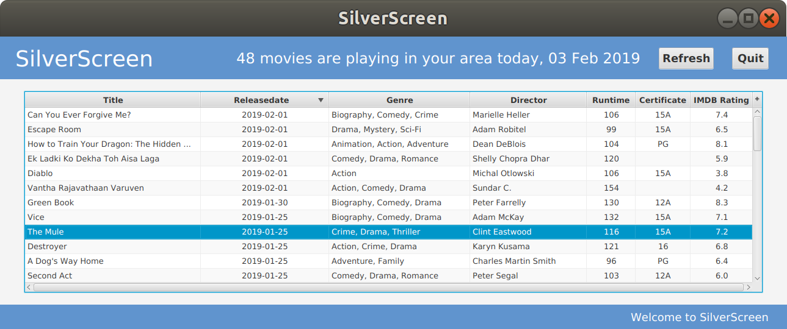
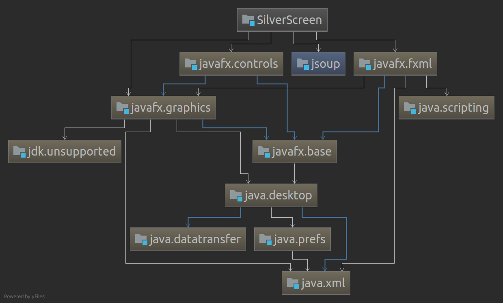

# Description

SilverScreen is a Java application that downloads, parses and displays information about movies that are playing in your area.

# Requirements

A Java Runtime Environment (JRE) is required in order to execute the compiled code.

The source code of this project uses Maven and has the following dependencies:
- Jsoup
- OpenJFX (javafx.controls, javafx.graphics, javafx.fxml)

# How to run

### Jar

Github will host a compiled version of this source code (a jar file) as a Github Release which can be run with the command

`java silverScreen.jar`

## Snap

Work is being done to package this application as a Snap package

# Screenshots

Main GUI (Latest movies)

# Documentation

Maven dependency diagram

# Issues

Issues can be raised by submitting them [here](https://github.com/thanders/silverScreen/issues/ "Github repository issues")

# Works Cited
[OpenJFX](https://openjfx.io/ "OpenJFX website")

[Jsoup](https://jsoup.org/ "Jsoup website")
